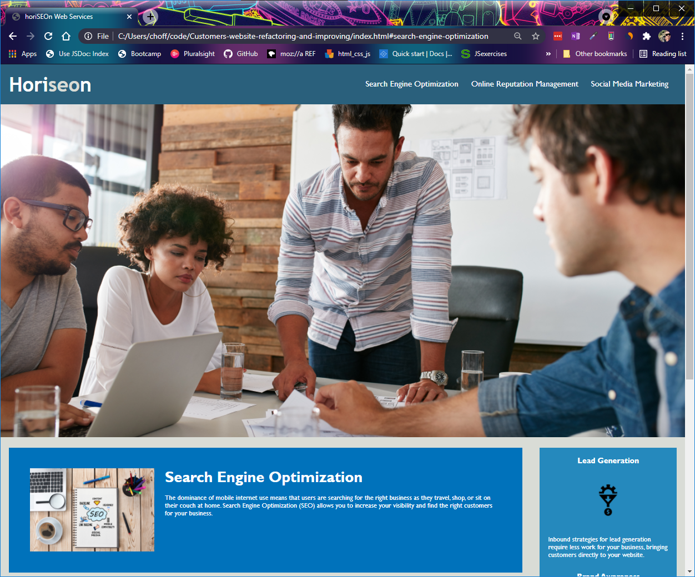

### Customers-website-refactoring-and-improving
Better accessibility standards and improved SEO
<!-- TABLE OF CONTENTS -->

  
Table of Contents

  <ol>
    <li>
      <a href="#about-the-project">About The Project</a>
      <ul>
        <li><a href="#built-with">Built With</a></li>
      </ul>
    </li>
    <li><a href="#Deployed Link">Link</a></li>
  </ol>

<!-- ABOUT THE PROJECT -->
## About The Project

A MOCK-UP marketing agency wanted a codebase that follows accessibility standards, and is SEO optimized.

I fixed thier started code to be semantic, with logical structure, giving img elements an alt asttribute, and giving this site a good title.

## Built With

-html
-css

## Deployed Link

[link to Deployed Page](https://mrfivefourone.github.io/Customers-website-refactoring-and-improving/)